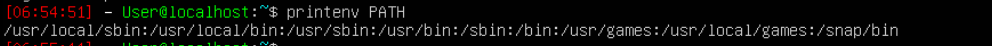
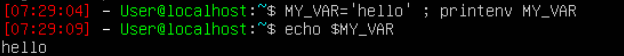
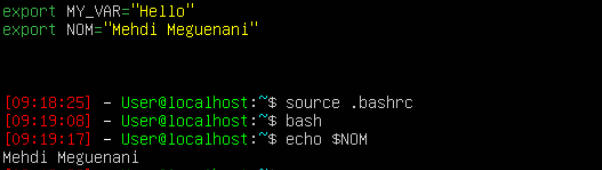
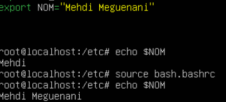
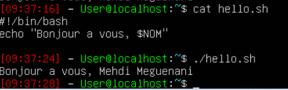
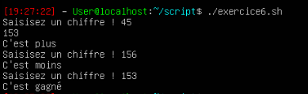
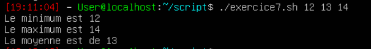
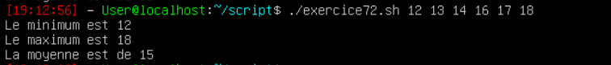
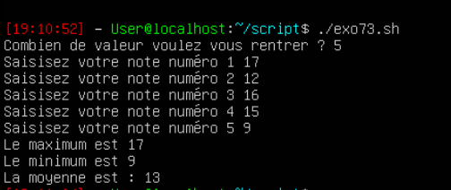

Mehdi Meguenani 3ICS

# Exercice 1. Variables d’environnement 

1. 
2. La variable d'environement qui permet a cd de nous renvoyer vers le répertoire est $HOME 
3. La variable LANG détermine la langue utilisé par le système afin de communiquer avec l'utilisateur. La variable PWD permet de lister le répertoire qui est utilisé. La variable OLDPWD permet enregistre le répertoire précédent et donc d'y accèder a l'aide de cd-. La commande shell interprète les commande de l'utilisateur 
4. 
5. La commande bash permet de créer un nouveau shell , la variable $MY_VAR n'existe pas car c'est une variable local que l'on a créer dans un autres session
6. En la transformant en variable d'environement la variable est disponible a partir de tous les shell ou interpréteur.
7. 
   
8. Il faut ecire echo "Bonjour a vous, $NOM"

9. En faisant usnet on supprime totalement la varianble, elle n'existe plus. Si la varaible est vide elle existe toujours mais ne renverra rien.
10.  

# Exercice 2. Contrôle de mot de passe

```
#!/bin/bash
PASSWORD=test123
read -p 'Saisissez un mot de passe : ' -s pass
if [ $pass = $PASSWORD ]; then
        echo "C'est le bon mot de passe"
else
        echo "Se n'est pas le bon mot de passe"
fi

```


# Exercice 3. Expressions rationnelles

``` 
#!/bin/bash

function is_number()
{
re='^[+-]?[0-9]+([.][0-9]+)?$'
if ! [[ $1 =~ $re ]] ; then
        return 1
else
        return 0
fi
}

is_number $1

echo "$?"
```
# Exercice 4. Contrôle d’utilisateur

```

#!/bin/bash
function test(){
        if  [ -z $1 ]: then
                echo "Utilisation : $0, nom utilisateur"
        else
                grep -F "$1" /etc/passwd > test1
                        if [ $? != 0 ]; then
                               echo "L'utilisateur n'exsite pas " 
                        else 
                                echo "L'utilisateur existe "
                        fi
       fi
}

test $1 

```
 

# Exercice 5. Factorielle

```
#!/bin/bash
facto=1
for i in $(seq 1 $1)
do 
       resultat=$(( $facto * $i ))
       facto=$resultat
done

echo "$resultat"
```
 

# Exercice 6. Le juste prix

```
#!/bin/bash
nombre=$(($RANDOM% 1000))
read -p "Saisissez un chiffre ! " chiffre
while [ $chiffre != $nombre ]
do
        if [ $chiffre -gt $nombre ]; then
                echo "C'est moins"
        fi
        
        if [ $chiffre -lt $nombre ]; then
                echo "C'est plus"
        fi
        read -p "Saisissez un chiffre ! " chiffre
done

echo "C'est gagné ! "
```
 
# Exercice 7.1 Statistiques

```
#!/bin/bash
 
error=0
max=0
min=0
moyenne=0

function is_number()
{
re='^[+-]?[0-9]+([.][0-9]+)?$'
if ! [[ $1 =~ $re ]] ; then
        return 1
else
        return 0
fi
}

function max(){
        if { $1 -gt $2}; then
                max=$1
        elif { $3 -gt $1 }; then
                max=$3
        else
                max=$2
        fi
}

function min(){
        if [ $1 -lt $2 ]; then
                min=$1
        elif [ $3 -gt $1 ]; then
                min=$3
        else
                min=$2
        fi
}

function moyenne(){
        moyenne=$((( $1 + $2 + $3 ) / 3 ))
}

min $1 $2 $3
max $1 $2 $3
moyenne $1 $2 $3

while (("$#"));
do
        is_number $1
        if [ $? = 1 ] || [ $1 -gt 100 ] || [ $1 -lt -100 ]; then
                echo "Veuillez saisir des nombres compris entre 100 et -100"
                exit
        fi
        shift
done

echo "Le minimum est $min"
echo "Le maximum est $max"
echo "La moyenne est $moyenne"


```
 

# Exercice 7.2 Statistiques

```
#!/bin/bash
 
max=0
min=$1
moyenne=0
param=0
count=0
sum=0

function is_number()
{
re='^[+-]?[0-9]+([.][0-9]+)?$'
if ! [[ $1 =~ $re ]] ; then
        return 1
else
        return 0
fi
}

function max(){
        if { $1 -gt $max}; then
                max=$1
        fi
}

function min(){
        if [ $1 -lt $min ]; then
                min=$1
        fi
}


function moyenne(){
        moyenne=$((( $1 + $2 + $3 ) / 3 ))
}

min $1 $2 $3
max $1 $2 $3
moyenne $1 $2 $3

while (("$#"));
do
        is_number $1
        if [ $? = 1 ] || [ $1 -gt 100 ] || [ $1 -lt -100 ]; then
                echo "Veuillez saisir des nombres compris entre 100 et -100"
                exit
        fi
        param=$(( $1 + $param ))
        sum=$param
        min $1
        max $1
        count=$(( $count + 1 ))
        shift
done

function moyenne(){
        moyenne=$(( $sum / $count ))
}

moyenne

echo "Le minimum est $min"
echo "Le maximum est $max"
echo "La moyenne est $moyenne"


```

 


# Exercice 7.3 Statistiques

```
#!/bin/bash
 
max=0
moyenne=0
param=0
sum=0
tab=()
index=0

read -p "Colmbien de note voulez vous saisir ? " nbr

function is_number()
{
re='^[+-]?[0-9]+([.][0-9]+)?$'
if ! [[ $1 =~ $re ]] ; then
        return 1
else
        return 0
fi
}

function tableau(){
        for i in $(seq 1 $nbr)
        do
                read -p "Saisi votre note numéro $i " note
                tab[$index]=$note
                index=$(( $index + 1 ))
        done
 }
 
 tableau
 
 min=${tab[0]}

function max(){
        local index=0
        for l in $(seq l $nbr)
        do
                if [ ${tab[index]} -gt $max ]; then
                        max=${tab[$index]}
                fi
                index=$(( $index + 1 ))
        done
        echo "Le maximum est $max"
}

max

function min(){
        local index=0
        for l in $(seq l $nbr)
        do
                if [ ${tab[index]} -gt $min ]; then
                        min=${tab[$index]}
                fi
                index=$(( $index + 1 ))
        done
        echo "Le maximum est $min"
}


min


function moyenne(){
        local index=0
        for l in $(seq l $nbr)
        do
                param=$(( $param + ${tab[$index]} ))
                sum=$param
                index=$(( $index + 1 ))
        done
        echo "La moyenne est $moyenne "
}

moyenne


```
 


